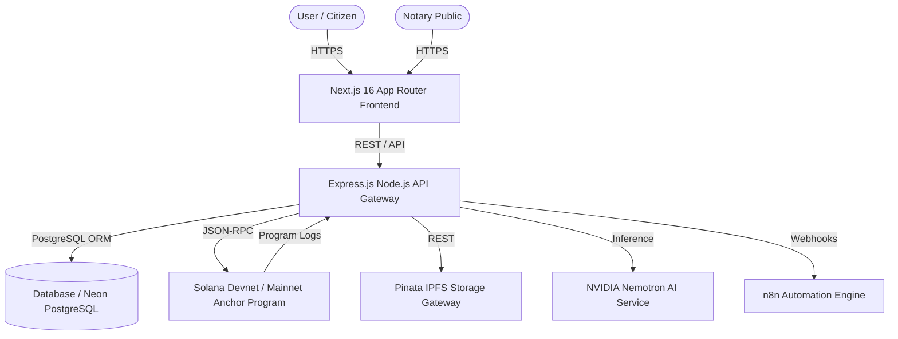

# Legal TimeLock Network (LTN)

[](https://github.com/madhavansingh/TimeLock/actions/workflows/ci.yml)
[](LICENSE)
[](https://solana.com)
[](https://nextjs.org)
[](https://www.typescriptlang.org)

**Legal TimeLock Network (LTN)** is an enterprise-grade, decentralized legal document timestamping, verification, and digital twin management platform built on the **Solana Blockchain**. LTN provides tamper-proof chain-of-custody tracking, AI-assisted risk assessment (NVIDIA Nemotron), IPFS decentralized storage (Pinata), and real-time notary attestation workflows.

---

## 🏗 System Architecture



---

## ✨ Key Features

- **🔒 Solana TimeLock Smart Contract:** Custom Rust Anchor smart contract ([blockchain/programs/legal_timelock](file:///Users/maddy/TimeLock/blockchain/programs/legal_timelock/src/lib.rs)) for immutable document hashing, registration, and signer verification.
- **🛡 Property Digital Twin:** Real-time state tracking and national trust score calculation for physical/digital property title records.
- **🤖 Autonomous AI Risk Assessment:** Multi-agent evaluation engine powered by NVIDIA Nemotron for detecting fraud risk, title anomalies, and missing evidence.
- **📜 Multi-Signer Notary Workflow:** Comprehensive operations portal for accredited Notaries to execute digital signatures and resolve legal challenges.
- **📦 IPFS Encrypted Storage:** Decentralized document pinning via Pinata IPFS integration.
- **⚡ High Performance:** pnpm monorepo architecture with dynamic component loading for 3D visualization canvases.

---

## 📂 Repository Structure

```
TimeLock/
├── backend/            # Express.js REST API server & Prisma ORM
├── frontend/           # Next.js 16 App Router web interface (Tailwind CSS, Radix UI)
├── blockchain/         # Solana Anchor smart contract (Rust) & TypeScript SDK
├── shared/             # Workspace package for shared types, enums, & schemas
├── docs/               # System architecture, PRD, SRS, & implementation plans
│   └── hackathon/      # Hackathon scope, pitch, and demo workflow documents
├── docker-compose.yml  # Docker orchestration setup
├── pnpm-workspace.yaml # Monorepo workspace configuration
└── package.json        # Root workspace scripts & dependencies
```

---

## 🚀 Quickstart Guide

### Prerequisites

- **Node.js**: `>= 20.0.0`
- **pnpm**: `>= 9.0.0` (`corepack enable pnpm`)
- **PostgreSQL**: `>= 15.0` (or Neon DB connection string)
- **Rust & Anchor CLI**: (Optional, required for smart contract development)

### 1. Installation

Clone the repository and install all monorepo dependencies:

```bash
git clone https://github.com/madhavansingh/TimeLock.git
cd TimeLock
pnpm install
```

### 2. Environment Setup

Copy template environment configuration files:

```bash
cp .env.example .env
cp backend/.env.example backend/.env
cp frontend/.env.example frontend/.env.local
```

Edit `backend/.env` with your PostgreSQL database URL, JWT secret, and API keys.

### 3. Database Migration & Seeding

```bash
cd backend
npx prisma db push
npx prisma db seed
cd ..
```

### 4. Running Local Development Server

Start all services (backend + frontend) concurrently:

```bash
pnpm dev
```

- **Frontend:** [http://localhost:3000](http://localhost:3000)
- **Backend API:** [http://localhost:5001/v1](http://localhost:5001/v1)

---

## 🐳 Docker Deployment

To launch the complete stack with PostgreSQL, backend API, and Next.js frontend:

```bash
docker-compose up --build
```

---

## 🛠 Available Workspace Scripts

Run commands across the entire monorepo from the root:

```bash
# Build all packages (shared, backend, frontend, blockchain)
pnpm build

# Typecheck all packages
pnpm typecheck

# Run linter across packages
pnpm lint

# Clean all build outputs and node_modules
pnpm clean
```

---

## 📄 License

This repository is licensed under the [MIT License](LICENSE).
