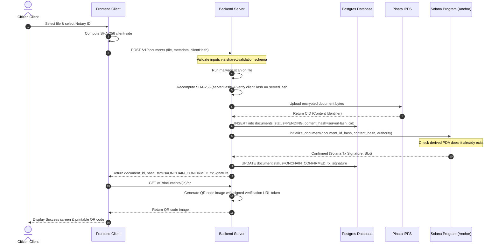
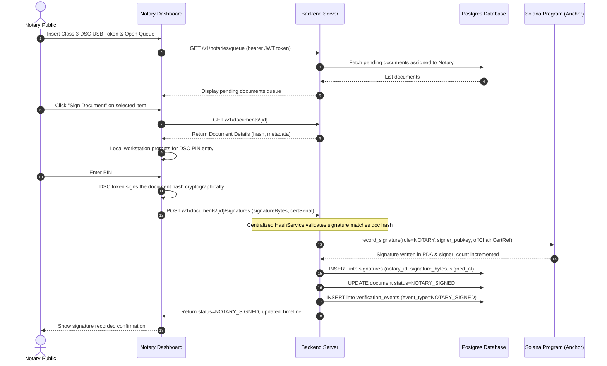
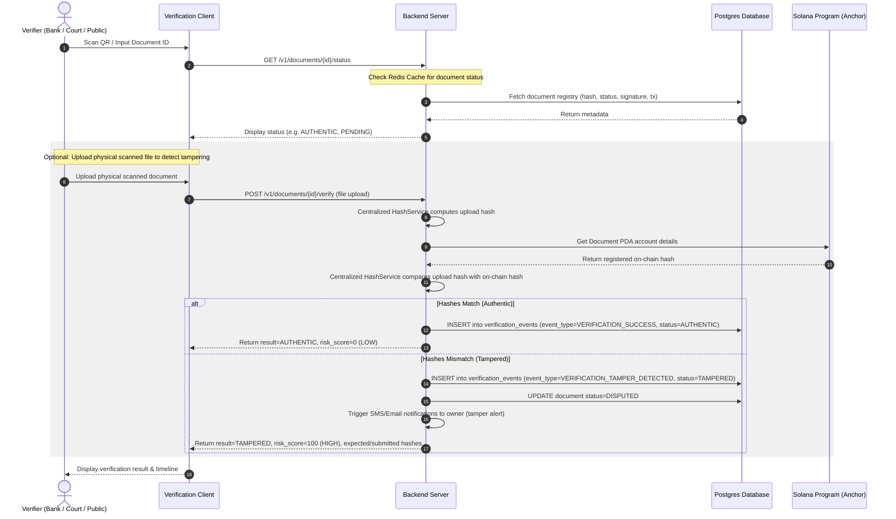

# Sequence Diagrams - Legal TimeLock Network (LTN)

This document contains sequence diagrams detailing the communication and data flows between the Frontend Client, Backend API Gateway/Services, Database, IPFS, and Solana cluster.

---

## 1. Document Upload & Registration Sequence

---

## 2. Notary Signing Sequence

---

## 3. Document Verification & Tamper Detection Sequence

