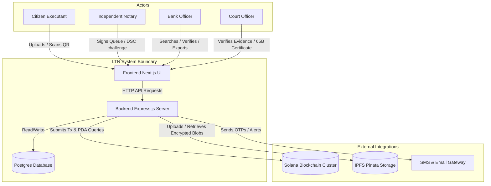

# System Context - Legal TimeLock Network (LTN)

This document provides a high-level system context for the Legal TimeLock Network (LTN). It outlines the system boundaries, the primary actors who interact with the system, and the external third-party services integrated into the architecture.

## System Context Diagram

The diagram below illustrates how users and external services interface with the Legal TimeLock Network:

---

## 1. System Boundary Description

The **Legal TimeLock Network** is split into three main internal packages:
1. **Frontend (Next.js 15 UI)**: Serve web application views for citizens (uploads, QR checks), notaries (signing queues), banks, and courts (dashboards and document details). Communicates strictly with the Backend over HTTPS APIs.
2. **Backend (Express.js Server)**: Orchestrates business logic, user authentication, rule-based risk scoring, and storage retrieval. Handles access control checks (RBAC) and writes relational data to PostgreSQL.
3. **Database (PostgreSQL)**: Serves as the off-chain system of record. Logs user data, document status indexes, signatures, verification event histories, and administrative audit logs.

---

## 2. System Actors

The system serves four primary human user groups and one system role:
* **Citizen Executant ("Priya")**: Uploads scanned agreements, receives printable QR codes, and verifies authenticity. Interacts with the platform using simple OTP-based authentication.
* **Independent Notary ("Advocate Rao")**: Accesses a queue of assigned documents, reviews hashes, and signs using Class 3 DSC tokens.
* **Bank Credit/Risk Officer ("Anjali")**: Inspects loan documents by scanning QR codes, views verification status and fraud risk scores, and downloads reports.
* **Court Officer / Clerk**: Validates electronic documents submitted as evidence. Retraces custody timelines and downloads Section 65B-aligned electronic certificates.
* **LTN Relayer Authority (System)**: System-owned wallet that submits and pays transaction fees for committing document details to Solana.

---

## 3. External Integrations

LTN bridges physical legal documents with decentralized trust by integrating with three primary external networks:
* **Solana Blockchain**: A high-throughput, low-fee public ledger. It hosts the Anchor program which stores document hashes, timestamps, and notary signatures permanently in Program Derived Addresses (PDAs).
* **IPFS Pinata Storage**: A decentralized content-addressed file network. Holds client-side or server-side encrypted documents. The backend database stores only the resulting IPFS Content Identifiers (CIDs) and cryptographic keys reference (never raw keys).
* **SMS & Email Gateway**: Sends OTP validation codes to citizens for authentication and notifies document owners of status changes or tamper alerts.
