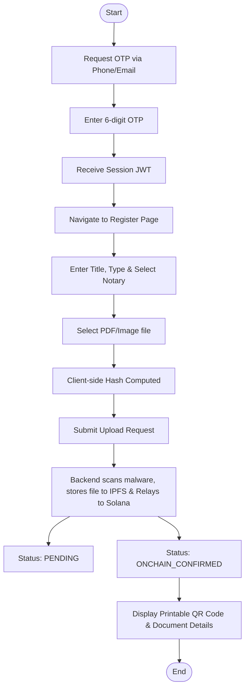
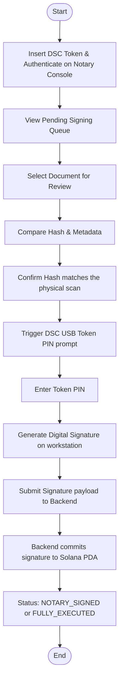
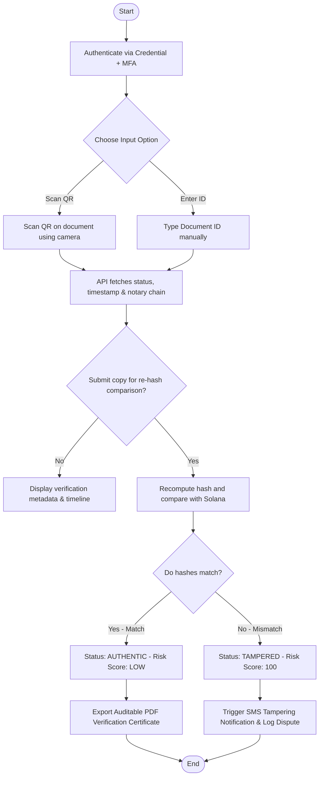

# User Flows - Legal TimeLock Network (LTN)

This document maps out the specific user flows and state transitions for the three core personas: Priya (Citizen Executant), Advocate Rao (Independent Notary), and Anjali (Bank Credit/Risk Officer).

---

## 1. Persona 1: Priya (Citizen Executant) - Document Registration Flow

Priya wants to secure a property sale agreement by registering it on the Legal TimeLock Network without needing to understand blockchain technology.

---

## 2. Persona 2: Advocate Rao (Independent Notary) - Digital Signing Flow

Advocate Rao needs to digitally sign a registered document using his Class 3 DSC USB hardware token.

---

## 3. Persona 3: Anjali (Bank Credit/Risk Officer) - Document Verification Flow

Anjali is processing a loan application and wants to verify the authenticity of a physical deed with a printed QR code.

