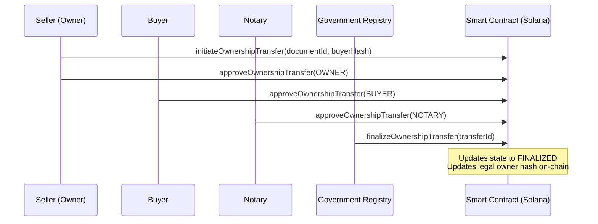
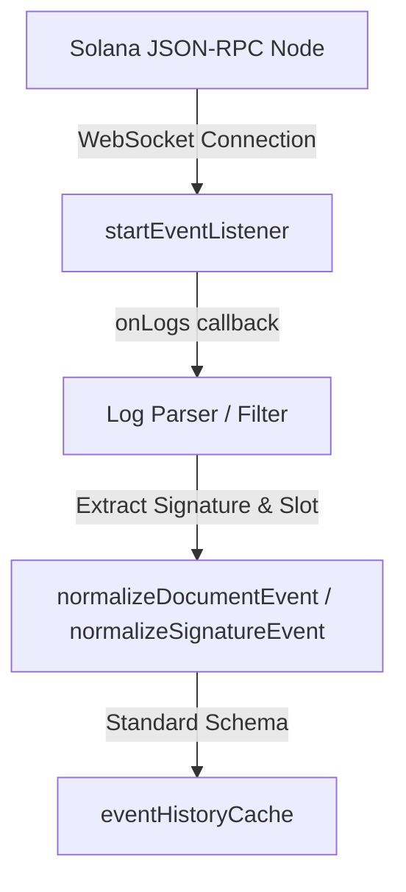
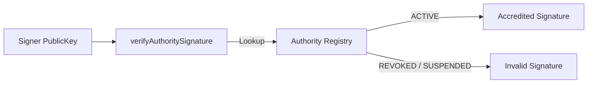

# Legal TimeLock Network (LTN) - Blockchain Integration Layer

This directory contains the Solana blockchain integration layer for the Legal TimeLock Network (LTN). It provides a secure, immutable trust layer for land record registration, multi-party approvals, ownership transfers, and verification audits.

---

## 1. Storage Reference Model

The storage reference layer provides an immutable link between on-chain metadata and off-chain document binaries stored in distributed or archival systems.

### Design Principles
- **Provider Agnostic**: The model does not hardcode any specific storage network (such as IPFS). It supports IPFS, Arweave, S3, or government archival systems through abstract adapters.
- **Tamper Evidence**: Document integrity is enforced by registering the cryptographic SHA-256 fingerprint on-chain, alongside the storage provider name and resource identifier.

### Data Structures

```typescript
export interface StorageReference {
  documentId: string;
  storageProvider: string; // e.g. 'IPFS' | 'Arweave' | 'S3' | 'GovArchive'
  storageIdentifier: string; // e.g. CID, S3 key, transaction ID
  documentHash: string; // Cryptographic SHA-256 hash of the content
  uploadedAt: number; // Upload timestamp
  verificationStatus: string; // 'VERIFIED' | 'TAMPERED'
}
```

---

## 2. Ownership Transfer Flow

The ownership transfer engine coordinates multi-signature approval loops for changing land record title deeds.

### Approval Requirements
A property transfer is not finalized until it gains all mandatory approvals:
1. **Seller (Owner)**: Grants permission to release the title.
2. **Buyer**: Signifies intent to purchase and accept the title.
3. **Notary Authority**: Attests to the legality of the transaction.
4. **Government Registry**: Finalizes the transfer, updating the official record.



---

## 3. QR Verification Architecture

QR codes allow offline, instant validation of land records by encoding a secure, tamper-detectable verification proof package.

### Architecture Highlights
- **HMAC Signatures**: Every payload includes an integrity checksum generated using a secure secret key, preventing third parties from fabricating verify links or spoofing record results.
- **Solana Proof Link**: Points directly to the document's Program Derived Address (PDA) on the Solana Devnet.

```typescript
export interface QRVerificationPayload {
  documentId: string;
  verificationReference: string; // e.g. URL to verify web page
  blockchainProofReference: string; // Solana PDA Address
  integrityChecksum: string; // HMAC-SHA256 checksum
  issuedAt: number;
}
```

---

## 4. Verification Bundle Structure

The `VerificationBundle` is the master trust package generated for courts, financial institutions, and government authorities to perform comprehensive audits.

### Structure Composition

```typescript
export interface VerificationBundle {
  documentProof: DocumentProof; // On-chain account state and authority keys
  courtProof: CourtVerificationProof; // Section 65B compliance and notary DSC signatures
  bankProof: BankVerificationProof; // Risk scoring, pending approvals, and audit trails
  ownershipHistory: OwnershipTransfer[]; // Complete chain of custody transfers
  storageVerification: StorageVerificationResult; // Agnostic off-chain storage integrity audit
  qrPayload: QRVerificationPayload; // Tamper-detectable QR validation envelope
  generatedAt: number; // Compilation timestamp
  bundleHash: string; // SHA-256 checksum of the entire package
}
```

---

## 5. Event Architecture & WebSocket Listener Flow

LTN uses a lightweight WebSocket observer to monitor program logs on Solana Devnet in real time, alerting clients of on-chain state changes.



---

## 6. Audit Trail Generation

The Audit Log Engine registers chronological lifecycle actions performed by citizens, notaries, and automated validators. It provides absolute traceability for compliance auditing.

- **Who**: Tracks actors (e.g. "Citizen Executant", "Notary Rao").
- **What**: Action records (`REGISTER_DOCUMENT`, `RECORD_SIGNATURE`, `RUN_INTEGRITY_SCAN`).
- **Signature**: Unique transaction signature reference.
- **Portability**: Exporters compile and serialize logs into standard JSON strings (`exportAuditTrailAsJSON()`).

---

## 7. Compliance Exporter & Evidence Package Structure

The compliance layer compiles documents, signatures, storage, and transaction history into a regulatory evidence package suitable for judicial and administrative verification.

### Evidence Package Components
- **PDA Address & Authority**: Identifies the smart contract parameters.
- **Timeline Records**: Chronological lifecycle events.
- **Compliance Report**: Flags compliance against key regulatory acts (e.g. Indian Evidence Act Sec 65B).
- **Checksum**: The `evidencePackageHash` guarantees that the evidence bundle itself has not been altered since generation.

---

## 8. Cryptographic Trust Model & Signer Abstraction

LTN employs Ed25519 signature verification to guarantee absolute non-repudiation of approvals.

```typescript
export interface WalletAdapter {
  publicKey: string;
  connect(): Promise<void>;
  disconnect(): Promise<void>;
  signTransaction(txBuffer: Buffer): Promise<Buffer>;
  signMessage(message: Buffer): Promise<Buffer>;
}
```
Through abstract adapters (`WalletAdapter`, `SignerAdapter`), the SDK can plug into third-party wallet interfaces (Phantom, Solflare) or HSM/relayer infrastructure seamlessly.

---

## 9. Authority Verification & Certificate Chain Flow

ACC (Accredited Authority Control) requires all transaction signers claiming stakeholder roles to be registered in a verified status.



Digital Signature Certificates (DSC) validate notary identities by auditing certificate validity windows and verifying the cryptographic chain against intermediate authorities (`validateCertificateChain()`).

---

## 10. Trust Score Methodology

The Trust Score Engine translates blockchain, cryptographic, and workflow metrics into a single numeric trust indicator (0-100):

$$\text{Trust Score} = \text{Signature Validity (20)} + \text{Approval Completeness (25)} + \text{Ownership Integrity (25)} + \text{Authority Status (15)} + \text{Compliance (15)}$$

- **0 - 50**: Critical warnings (disputed status, signature forgery, chain sequence gap).
- **50 - 85**: Pending stakeholder approvals or unverified notary certificate.
- **85 - 100**: Verified, authentic land record.

---

## 11. Production Security Model & Configurations

The SDK supports three configuration profiles:
- **Development**: Permissive checks with mock overrides.
- **Demo**: Lightweight cluster dependencies and simulated catch-block failover.
- **Production**: Enforces strict verification. catch-block fallbacks are deactivated, and all failed transactions or signature mismatches propagate exceptions directly to callers.


