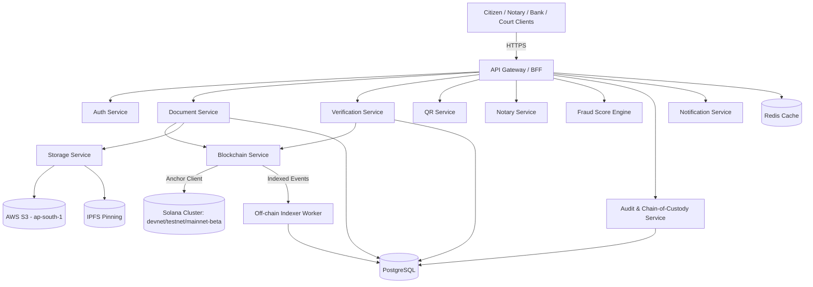
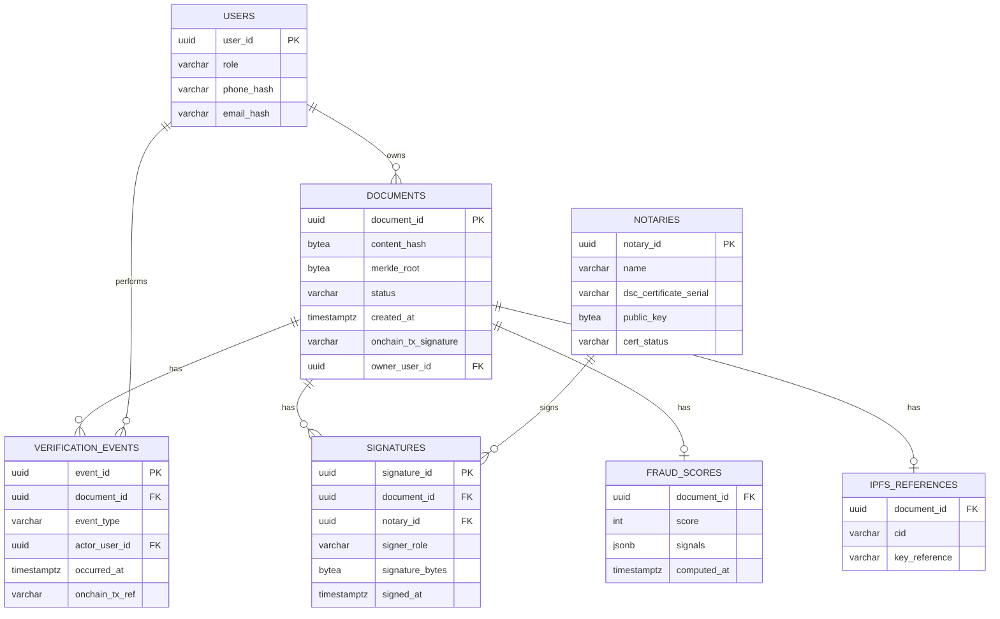
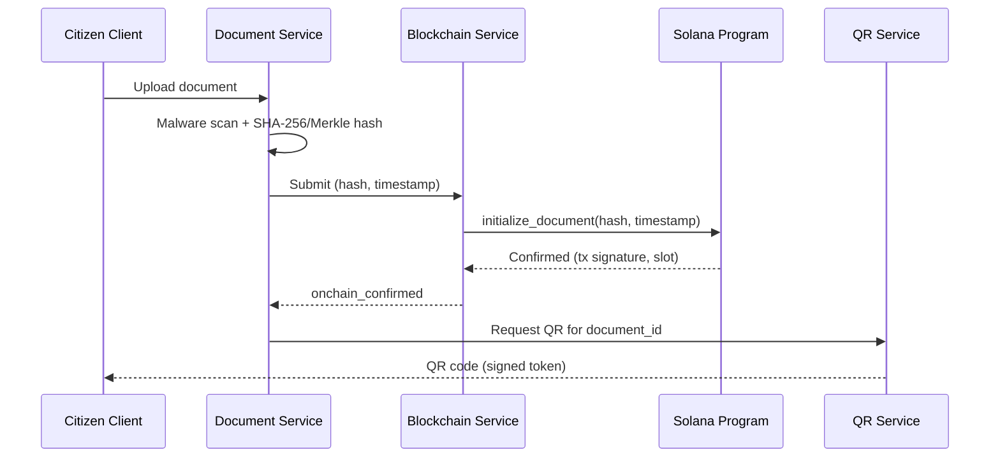
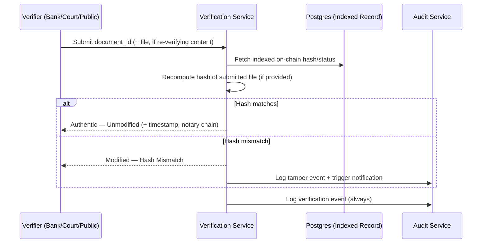
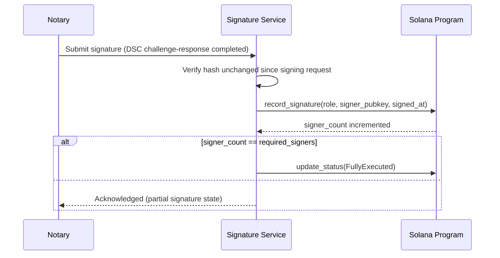
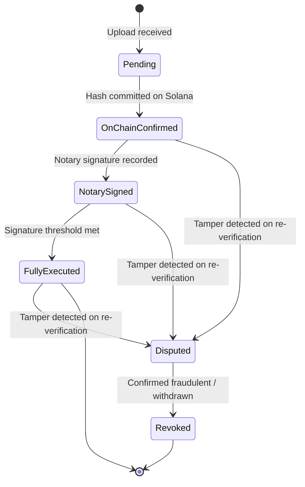
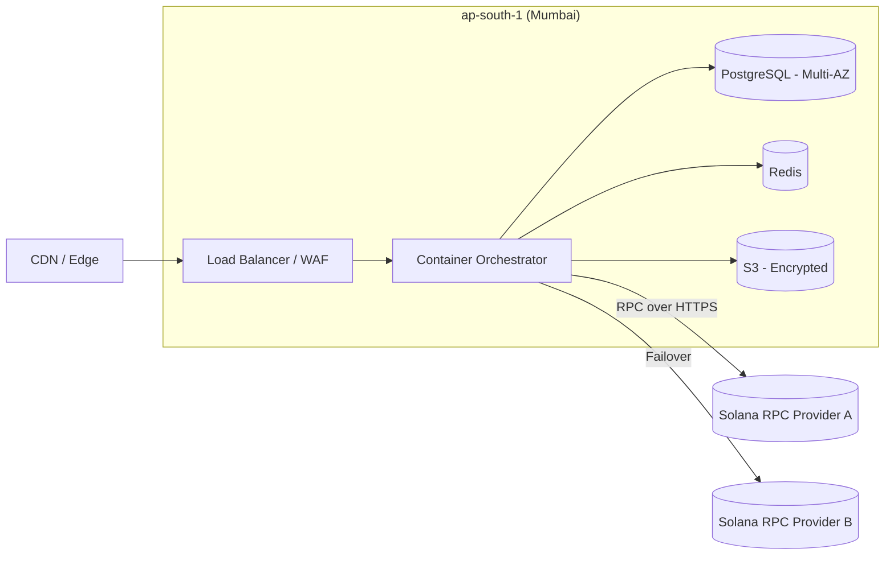

# Legal TimeLock Network
## System Design Document (SDD)

### Document Control

| Field | Value |
|---|---|
| Document Title | System Design Document — Legal TimeLock Network (LTN) |
| Version | 2.0 — Industry Release |
| Status | Draft for Architecture Review Board |
| Related Documents | `01_product_requirements_document.md`, `02_software_requirements_specification.md`, `04_implementation_plan.md` |

---

## Table of Contents

1. Introduction & Design Goals
2. Architectural Overview
3. Component Design
4. Solana Program (On-Chain) Design
5. API Design
6. Database Design
7. Caching Strategy
8. Data Flow Diagrams
9. Security Architecture
10. Scalability & Performance Design
11. Deployment Architecture
12. Observability — Logging, Metrics, Tracing
13. Disaster Recovery & Backup Strategy
14. Technology Trade-off Justification
15. Appendix A — Anchor IDL Excerpt
16. Appendix B — Sample API Payloads

---

## 1. Introduction & Design Goals

This SDD translates the requirements in the SRS into a concrete architecture. Design priorities, in order:

1. **Verifiability over convenience** — any design choice that would let LTN itself silently alter a timestamp or hash is rejected, even if it simplifies engineering.
2. **Zero blockchain literacy required of end users** — wallets, gas, and RPC details are entirely abstracted behind the platform.
3. **Data minimization on-chain** — only hash, timestamp, and status; everything else stays off-chain and governable.
4. **Modular services** — each capability in the SRS maps to an independently deployable, independently testable component.
5. **India-first compliance posture** — data residency, DSC-based signing, and Evidence Act-aware certificate generation are first-class design constraints, not afterthoughts.

---

## 2. Architectural Overview

LTN follows a **modular service architecture** (not a full microservices mesh at MVP scale — see §14 for the trade-off rationale): a set of independently deployable Node.js/TypeScript services behind an API gateway, a Postgres system of record, a Redis cache, an off-chain encrypted blob store (S3 + IPFS), and a Solana Anchor program as the trust anchor.



**Why an off-chain indexer instead of querying Solana RPC on every dashboard read?** Solana RPC calls are well-suited to transaction submission and point lookups, but are not efficient for the bulk search/filter/export patterns required by F-07. The indexer subscribes to program account changes/events and materializes them into Postgres, which the dashboard queries directly — keeping the RPC hot path limited to registration and single-document verification.

---

## 3. Component Design

| ID | Component | Responsibilities | Maps to SRS |
|---|---|---|---|
| COMP-01 | Document Service | Upload handling, malware scan, SHA-256/Merkle hashing, Document ID issuance | FR-02.x |
| COMP-02 | Verification Service | Re-hash on verify, hash comparison, status resolution, chain-of-custody event emission | FR-05.x, FR-06.x |
| COMP-03 | Blockchain Service | Anchor client wrapper, transaction construction/retry/backoff, PDA derivation, confirmation polling | FR-01.x |
| COMP-04 | QR Service | Token signing/expiry, QR image generation, public verification page resolution | FR-03.x |
| COMP-05 | Notary / Signature Service | DSC challenge-response, signature binding to hash+timestamp, multi-sig threshold tracking | FR-04.x, FR-10.x |
| COMP-06 | Dashboard / API Gateway (BFF) | Auth-aware routing, institutional search/export, public API key validation & rate limiting | FR-07.x, FR-14.x |
| COMP-07 | Storage Service | Client/server-side encryption, S3 + IPFS dual-write, CID/key-reference management | FR-08.x |
| COMP-08 | Audit & Chain-of-Custody Service | Append-only event log enforcement, administrative audit trail | FR-06.x, FR-13.x |
| COMP-09 | Fraud Score Engine | Rule evaluation, weighted scoring, signal explanation generation | FR-09.x |
| COMP-10 | Auth Service | OTP issuance/validation, DSC token session handling, institutional MFA/SSO, RBAC enforcement | FR-11.x |
| COMP-11 | Notification Service | SMS/email/push dispatch, templating, delivery retries | FR-12.x |
| COMP-12 | Legal Document Generator | Section 65B-aligned certificate templating and generation | FR-15.x |
| COMP-13 | Off-chain Indexer Worker | Subscribes to Solana program account/event changes, materializes into Postgres | Supports COMP-02, COMP-06 |

Each component is built as an independently deployable Node.js/TypeScript service (Express.js) with its own data-access boundary into Postgres (shared database, schema-isolated by component, to keep MVP/Pilot operational complexity manageable — see §14).

---

## 4. Solana Program (On-Chain) Design

### 4.1 Design Rationale
The on-chain program's only job is to make the (hash, timestamp, status) tuple **tamper-evident and independently auditable** — not to store or process documents. This keeps on-chain rent/storage costs minimal and avoids any path by which PII or document content could end up on a public ledger.

### 4.2 Account Structure

```rust
#[account]
pub struct DocumentRecord {
    pub document_id_hash: [u8; 32],   // hash of the off-chain Document ID, used as PDA seed material
    pub content_hash: [u8; 32],       // SHA-256 of the document (or Merkle root for multi-page)
    pub timestamp: i64,               // Unix timestamp at first confirmation
    pub status: DocumentStatus,       // enum: Pending, Confirmed, NotarySigned, FullyExecuted, Disputed, Revoked
    pub signer_count: u8,             // current count of recorded signatures
    pub required_signers: u8,         // multisig threshold (F-10)
    pub authority: Pubkey,            // LTN relayer authority that submitted the record
    pub bump: u8,                     // PDA bump seed
}

#[account]
pub struct SignatureRecord {
    pub document_record: Pubkey,      // parent DocumentRecord PDA
    pub signer_role: SignerRole,      // Notary, Buyer, Seller, Other
    pub signer_pubkey: Pubkey,
    pub signed_at: i64,
    pub off_chain_cert_ref: [u8; 32], // hash reference to the notary's DSC certificate metadata (not the cert itself)
}
```

### 4.3 PDA Seed Scheme
`DocumentRecord` PDA = `findProgramAddress(["document", sha256(document_id)], program_id)`. Using a hash of the application-level Document ID (rather than the raw UUID) as seed material avoids leaking any off-chain identifier structure on-chain and keeps seed length within Solana's PDA constraints.

`SignatureRecord` PDA = `findProgramAddress(["signature", document_record_pubkey, signer_role_byte], program_id)` — one signature slot per role, preventing duplicate signing under the same role.

### 4.4 Instructions

| Instruction | Purpose | Key Constraints |
|---|---|---|
| `initialize_document` | Creates the `DocumentRecord` account, sets hash/timestamp/status=Pending→Confirmed | Only callable by the LTN relayer authority; rejects if a record already exists for the derived PDA (prevents silent overwrite/backdating of an existing document) |
| `record_signature` | Creates a `SignatureRecord`, increments `signer_count` | Validates the submitted hash reference matches `DocumentRecord.content_hash` at signing time; rejects if `signer_count == required_signers` already (no extra signatures) |
| `update_status` | Transitions status (e.g., Confirmed → FullyExecuted once threshold met, or → Disputed) | Restricted to authority or to the program's own internal logic when `signer_count == required_signers` |
| `flag_dispute` | Marks a record as Disputed without altering `content_hash` or `timestamp` | Callable by authority on receipt of a verified tamper-detection event from COMP-02 |

The program deliberately has **no instruction capable of mutating `content_hash` or `timestamp` once set** — this is the core tamper-evidence guarantee, enforced at the program level, not merely the application level.

### 4.5 Events
Anchor events (`DocumentInitialized`, `SignatureRecorded`, `StatusUpdated`) are emitted on each instruction for COMP-13 (Off-chain Indexer) to consume via log subscription, avoiding the need for the indexer to poll account state continuously.

### 4.6 Compute & Rent Considerations
Each account is sized to minimize rent-exempt deposit cost; `DocumentRecord` is fixed-size (no dynamic-length fields) to keep compute-unit consumption for (de)serialization predictable and low, which matters at the target throughput (100,000 documents/day at GA).

### 4.7 Upgrade Authority & Governance
During MVP/Pilot, the program's upgrade authority is held by the LTN engineering team's secured multisig (e.g., 2-of-3 hardware-key holders) to allow rapid iteration on devnet/testnet. Before mainnet-beta GA, the Implementation Plan requires a security audit and a decision on whether to (a) transfer upgrade authority to a broader governance multisig including an independent party, or (b) make the program immutable (set upgrade authority to `None`) once the design is stable.

---

## 5. API Design

Base path: `/v1/`. All endpoints over HTTPS; institutional endpoints require Bearer JWT (issued post-MFA) or an API key (F-14); public verification endpoints require no authentication but are rate-limited by IP/token.

| Method | Path | Auth | Description |
|---|---|---|---|
| POST | `/v1/documents` | Citizen session | Upload document, returns `document_id`, hashing/registration status |
| GET | `/v1/documents/{id}/status` | Public (token-bound) | Returns status, timestamp, notary summary if public |
| POST | `/v1/documents/{id}/verify` | Public/Institutional | Submits a file for re-hash and tamper comparison |
| POST | `/v1/documents/{id}/signatures` | Notary/Party session | Submits a signature for a given role |
| GET | `/v1/documents/{id}/custody` | Institutional | Returns full chain-of-custody timeline |
| GET | `/v1/documents/{id}/certificate` | Institutional | Generates Section 65B-aligned certificate (F-15) |
| GET | `/v1/documents/search` | Institutional | Bulk search/filter (date range, status, notary) |
| GET | `/v1/documents/{id}/fraud-score` | Institutional | Returns score + contributing signals |
| POST | `/v1/notaries/{id}/onboard` | Admin | Notary onboarding incl. DSC certificate registration |
| POST | `/v1/auth/otp/request` | Public | Issues OTP to citizen phone/email |
| POST | `/v1/auth/otp/verify` | Public | Verifies OTP, issues session JWT |
| POST | `/v1/api-keys` | Admin | Issues institutional API key (F-14) |

All endpoints return a consistent envelope: `{ "data": ..., "error": null, "request_id": "..." }`, with `error` populated and HTTP 4xx/5xx on failure, to keep client-side handling uniform across the dashboard, mobile app, and third-party API integrators.

---

## 6. Database Design

### 6.1 Entity-Relationship Overview



### 6.2 Schema Detail (PostgreSQL DDL excerpt)

```sql
CREATE TABLE documents (
    document_id        UUID PRIMARY KEY DEFAULT gen_random_uuid(),
    content_hash        BYTEA NOT NULL,
    merkle_root          BYTEA,
    status               VARCHAR(32) NOT NULL DEFAULT 'pending',
    onchain_tx_signature VARCHAR(128),
    onchain_pda          VARCHAR(64),
    owner_user_id        UUID NOT NULL REFERENCES users(user_id),
    required_signers      SMALLINT NOT NULL DEFAULT 1,
    signer_count          SMALLINT NOT NULL DEFAULT 0,
    created_at            TIMESTAMPTZ NOT NULL DEFAULT now(),
    CONSTRAINT chk_status CHECK (status IN
        ('pending','onchain_confirmed','notary_signed','fully_executed','disputed','revoked'))
);
CREATE INDEX idx_documents_status_created ON documents (status, created_at);
CREATE INDEX idx_documents_owner ON documents (owner_user_id);

CREATE TABLE verification_events (
    event_id        UUID PRIMARY KEY DEFAULT gen_random_uuid(),
    document_id      UUID NOT NULL REFERENCES documents(document_id),
    event_type        VARCHAR(48) NOT NULL,
    actor_user_id      UUID REFERENCES users(user_id),
    actor_label        VARCHAR(64),         -- e.g. 'anonymous_scan' when actor_user_id is null
    onchain_tx_ref      VARCHAR(128),
    occurred_at         TIMESTAMPTZ NOT NULL DEFAULT now()
);
-- Append-only enforcement: revoke UPDATE/DELETE at the role level, not just via app logic
REVOKE UPDATE, DELETE ON verification_events FROM app_write_role;
CREATE INDEX idx_vevents_document ON verification_events (document_id, occurred_at);
```

*(Full DDL for `notaries`, `signatures`, `fraud_scores`, `ipfs_references`, `users`, `api_keys`, and `audit_logs` follows the same conventions: UUID primary keys, explicit CHECK constraints for enumerations, append-only protection via REVOKE on history tables, and composite indexes aligned to the dashboard's query patterns in FR-07.1.)*

### 6.3 Partitioning & Growth Strategy
`verification_events` is range-partitioned by month from GA onward, given it is the fastest-growing table (every scan, not just every registration, appends a row); `documents` remains unpartitioned until single-table row counts approach the tens of millions, at which point hash-based partitioning by `document_id` is the planned path.

---

## 7. Caching Strategy (Redis)

| Key Pattern | Value | TTL | Purpose |
|---|---|---|---|
| `doc:status:{document_id}` | Cached status/timestamp/notary summary | 30s | Absorb QR-scan read load without hitting Postgres on every public scan |
| `otp:{phone_hash}` | OTP code + attempt count | 5 min | FR-11.1 OTP expiry/lockout |
| `session:{jwt_id}` | Session metadata for revocation checks | Session lifetime | Institutional idle-timeout enforcement (FR-11.4) |
| `ratelimit:apikey:{key_id}` | Sliding-window counter | 1 min window | FR-14.2 API rate limiting |

Cache invalidation on `doc:status:*` is event-driven: COMP-13 (Indexer) publishes an invalidation on any status-changing on-chain event, so the cache never serves a stale "Authentic" result after a dispute/revocation.

---

## 8. Data Flow Diagrams

### 8.1 Registration Flow



### 8.2 Verification / Tamper Detection Flow



### 8.3 Multi-Signature Collection Flow



### 8.4 Document Lifecycle (State Diagram)



---

## 9. Security Architecture

### 9.1 Threat Model (STRIDE Summary)

| Threat Category | Example | Mitigation |
|---|---|---|
| Spoofing | Fake notary impersonation | Class 3 DSC hardware-token challenge-response; no password-only notary auth |
| Tampering | Document altered post-registration | On-chain immutable hash; program has no mutate-hash instruction |
| Repudiation | Notary denies signing | Signature cryptographically bound to hash+timestamp, anchored on-chain |
| Information Disclosure | PII leak via on-chain data | Strict on-chain data-minimization (hash/timestamp/status only) |
| Denial of Service | Flood of verification requests | Rate limiting (Redis sliding window), CDN/WAF in front of public endpoints |
| Elevation of Privilege | Citizen account accessing institutional dashboard data | Server-side RBAC enforcement on every endpoint, not just UI-level hiding |

### 9.2 Authentication Flows
Citizens: OTP → short-lived JWT. Notaries: DSC PKCS#11 challenge-response → session bound to certificate serial, re-validated per signing action (not just per login) so a stolen session token alone cannot sign a document. Institutional users: credential + MFA → JWT with RBAC claims, enforced at the API Gateway and re-checked at each service.

### 9.3 Key Management
- DSC private keys: never leave the notary's hardware token; only the resulting signature transits the network.
- Document encryption keys (F-08): generated and stored in a dedicated KMS (e.g., AWS KMS), referenced — never embedded — in the database; decryption requires an authorized request through the Storage Service, which itself logs the access.
- Relayer authority keypair (the LTN-controlled Solana account that pays for and submits transactions): stored in a hardware security module (HSM) or cloud KMS-backed signer, never on application servers in plaintext.

### 9.4 Application Security
OWASP ASVS Level 2 baseline: input validation on all upload endpoints, parameterized queries (no raw SQL string concatenation), CSP headers on all web surfaces, dependency scanning in CI (see Implementation Plan), and a mandatory third-party security assessment of both the application and the Anchor program before mainnet-beta.

---

## 10. Scalability & Performance Design

- **Read scaling:** Postgres read replicas for dashboard search/export load (FR-07.1), keeping the primary free for write-heavy registration/verification paths.
- **Write scaling:** Verification event writes are the highest-volume table; partitioned by month (§6.3) and written via a lightweight append path that avoids full-row locking contention.
- **Blockchain hot-path isolation:** Transaction submission and confirmation polling run in the Blockchain Service with its own connection pool to RPC providers, isolated from the request path of read-heavy dashboard queries — so an RPC slowdown cannot cascade into degrading verification status lookups (which are served from the indexed Postgres copy, per §2).
- **CDN/edge caching:** Public verification pages (read-heavy, low-sensitivity) are eligible for short-TTL edge caching, invalidated on status change via the same event-driven mechanism as the Redis cache (§7).
- **Horizontal scale-out:** All services are stateless and containerized, scaling horizontally behind the API Gateway; session state lives in Redis, not in-process memory.

---

## 11. Deployment Architecture

| Environment | Purpose | Solana Cluster |
|---|---|---|
| Local/Dev | Engineer workstation, fast iteration | Solana localnet / `solana-test-validator` |
| CI | Automated test runs on every PR | Localnet (ephemeral, spun up per pipeline run) |
| Staging | Pre-release validation, partner UAT | Solana devnet |
| Pilot/Beta | External notary/bank pilot users | Solana testnet |
| Production (GA) | Live, audited | Solana mainnet-beta |

**Infrastructure:** Frontend (Next.js) deployed on Vercel (or equivalent edge platform) for the citizen/marketing surfaces; backend services containerized (Docker) and orchestrated via a managed Kubernetes service or AWS ECS in the ap-south-1 (Mumbai) region to satisfy data-residency requirements; PostgreSQL via a managed RDS-equivalent with automated backups; Redis via a managed in-memory cache service; CI/CD via GitHub Actions running lint, unit tests, Anchor program tests (via `solana-program-test`/Bankrun), and a security/dependency scan gate before any deploy to staging or beyond.



---

## 12. Observability — Logging, Metrics, Tracing

- **Structured logging:** JSON logs with `request_id` correlation across all services, shipped to a centralized log store; no PII or document content logged at any verbosity level.
- **Metrics:** Prometheus-compatible metrics per service (request latency histograms, on-chain confirmation latency, retry counts, fraud-score distribution) visualized in Grafana dashboards mapped to the performance budgets in SRS §7.2.
- **Tracing:** OpenTelemetry distributed tracing across the registration and verification critical paths, including the RPC call boundary, to localize latency regressions to a specific hop (e.g., RPC provider vs. database vs. application logic).
- **Alerting:** Paging alerts on tamper-detection rate spikes, RPC provider failover events, and any breach of the p95 latency budgets.

---

## 13. Disaster Recovery & Backup Strategy

- The Solana ledger itself is the durable, independently-replicated source of truth for hash/timestamp/status — it does not require LTN-managed backup.
- PostgreSQL: continuous WAL archiving with point-in-time recovery (RPO 5 minutes), automated daily snapshots retained per the compliance retention schedule.
- S3/IPFS encrypted blobs: versioned S3 buckets with cross-region replication for disaster recovery of the encrypted copy (note: the IPFS-pinned copy provides an additional, independently-retrievable redundancy path).
- **Recovery drill cadence:** Quarterly restoration drills from backup into an isolated environment, validated against a checksum of known-good records, with results logged in the operational audit trail (COMP-08).

---

## 14. Technology Trade-off Justification

| Decision | Alternative Considered | Why Chosen |
|---|---|---|
| Solana (Anchor) | Ethereum / Polygon | Sub-second to low-second finality and materially lower per-transaction fees suit a high-volume (100k+/day target), India-first use case better than Ethereum L1 fee/latency profile; Polygon was a secondary candidate and remains a fallback option if Solana cluster economics or tooling change materially |
| Modular monolith-of-services (shared Postgres, schema-isolated) at MVP/Pilot | Full microservices with per-service databases from day one | Lower operational overhead for a small team through Pilot, while keeping clean service boundaries (COMP-01…13) so a later split to per-service databases is a refactor, not a rewrite |
| PostgreSQL | MongoDB / NoSQL | Strong relational integrity and CHECK/REVOKE-enforced append-only guarantees (critical for chain-of-custody tamper-evidence) are simpler to enforce in a relational engine with ACID guarantees |
| IPFS + encryption (not on-chain storage) | Storing documents directly on-chain | On-chain storage of document content would violate the data-minimization design goal, balloon on-chain rent costs, and create a permanent, irrevocable PII exposure risk |
| Off-chain indexer over direct RPC reads for dashboards | Querying Solana RPC directly per dashboard request | RPC providers are optimized for transaction submission/point lookups, not the bulk filter/search/export patterns institutional users need; indexing avoids RPC rate limits becoming a user-facing bottleneck |

---

## 15. Appendix A — Anchor IDL Excerpt (Illustrative)

```json
{
  "version": "0.1.0",
  "name": "legal_timelock_network",
  "instructions": [
    {
      "name": "initializeDocument",
      "accounts": [
        { "name": "documentRecord", "isMut": true, "isSigner": false },
        { "name": "authority", "isMut": true, "isSigner": true },
        { "name": "systemProgram", "isMut": false, "isSigner": false }
      ],
      "args": [
        { "name": "documentIdHash", "type": { "array": ["u8", 32] } },
        { "name": "contentHash", "type": { "array": ["u8", 32] } },
        { "name": "requiredSigners", "type": "u8" }
      ]
    },
    {
      "name": "recordSignature",
      "accounts": [
        { "name": "documentRecord", "isMut": true, "isSigner": false },
        { "name": "signatureRecord", "isMut": true, "isSigner": false },
        { "name": "signer", "isMut": true, "isSigner": true }
      ],
      "args": [
        { "name": "signerRole", "type": "u8" },
        { "name": "offChainCertRef", "type": { "array": ["u8", 32] } }
      ]
    }
  ]
}
```

## 16. Appendix B — Sample API Payloads

**`GET /v1/documents/{id}/status` — response**
```json
{
  "data": {
    "document_id": "8c2e...",
    "status": "fully_executed",
    "content_hash": "b94d27b9934d3e08...",
    "onchain_tx_signature": "5h3K...",
    "timestamp": "2026-04-12T09:41:03Z",
    "notary_summary": { "notary_id": "NTY-2291", "signed_at": "2026-04-12T10:02:11Z" },
    "signers": { "required": 3, "completed": 3 }
  },
  "error": null,
  "request_id": "req_7f1a..."
}
```

**`POST /v1/documents/{id}/verify` — mismatch response**
```json
{
  "data": {
    "document_id": "8c2e...",
    "result": "modified",
    "expected_hash": "b94d27b9934d3e08...",
    "submitted_hash": "1a9ef03cc0218b77...",
    "detected_at": "2026-06-18T11:15:42Z"
  },
  "error": null,
  "request_id": "req_91bd..."
}
```
