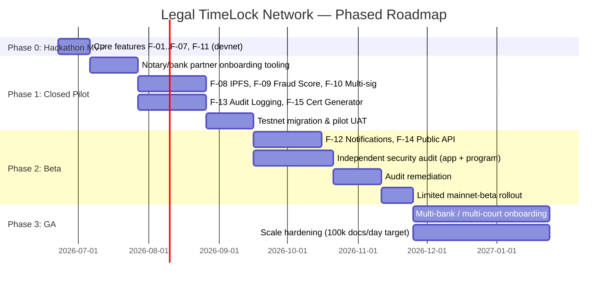

# Legal TimeLock Network
## Implementation Plan

### Document Control

| Field | Value |
|---|---|
| Document Title | Implementation Plan — Legal TimeLock Network (LTN) |
| Version | 2.0 — Industry Release |
| Status | Draft for Program/Engineering Leadership Sign-off |
| Related Documents | `01_product_requirements_document.md`, `02_software_requirements_specification.md`, `03_system_design_document.md` |

---

## Table of Contents

1. Program Overview
2. Team Structure & RACI
3. Delivery Methodology
4. Phased Roadmap & Timeline
5. Work Breakdown Structure
6. Environment & Cluster Strategy
7. Testing Strategy
8. Risk Register
9. Deployment & Release Plan
10. Hackathon Demo Plan (KLEOS 2026)
11. Post-Launch Operations
12. Resourcing Estimate
13. Compliance & Legal Roadmap
14. Success Criteria & Milestone Sign-off

---

## 1. Program Overview

This plan schedules the features defined in the PRD (`F-xx`) and requirements in the SRS (`FR-xx`) into deliverable phases, beginning with the KLEOS Hackathon 2026 MVP and extending through a production-grade, mainnet-beta GA. It assumes the architecture defined in the SDD (`COMP-xx`, Solana Anchor program) as the implementation target.

---

## 2. Team Structure & RACI

### 2.1 Core Roles

| Role | Count | Primary Responsibility |
|---|---|---|
| Product Manager | 1 | PRD ownership, prioritization, stakeholder alignment |
| Tech Lead / Solana Engineer | 1 | Anchor program design (SDD §4), architecture decisions |
| Backend Engineers | 2 | COMP-01–COMP-13 service implementation |
| Frontend Engineer | 1 | Citizen app, institutional dashboard |
| Mobile Engineer | 1 (from Pilot) | React Native citizen/notary app |
| DevOps / SRE | 1 | CI/CD, environments (§6), observability (SDD §12) |
| QA Engineer | 1 | Test strategy execution (§7) |
| UI/UX Designer | 1 | Accessibility (WCAG 2.1 AA), non-technical-user flows |
| Legal & Compliance Advisor | 1 (consulting) | Evidence Act/DPDP Act review, F-15 certificate template |
| Notary & Bank Partnerships Lead | 1 (from Pilot) | Onboarding, pilot relationship management |

### 2.2 RACI — Key Deliverables

| Deliverable | PM | Tech Lead | Backend | Frontend | DevOps | QA | Legal |
|---|---|---|---|---|---|---|---|
| PRD/SRS sign-off | A/R | C | C | C | I | I | C |
| Anchor program (SDD §4) | I | A/R | C | I | C | R | I |
| Verification/Tamper Detection | C | C | A/R | C | I | R | I |
| Institutional Dashboard | C | I | C | A/R | I | R | I |
| Security audit remediation | I | A | R | R | C | R | I |
| Section 65B certificate template | C | I | R | I | I | C | A/R |
| Mainnet-beta cutover | A | R | C | I | R | C | C |

*(A = Accountable, R = Responsible, C = Consulted, I = Informed)*

---

## 3. Delivery Methodology

- **Framework:** Scrum, 2-week sprints, with a hardening sprint before each phase gate (Pilot → Beta → GA).
- **Definition of Done:** Code merged with passing unit/integration tests, requirement ID(s) traced (SRS Appendix A), updated documentation, and — for anything touching the Anchor program — passing program tests on localnet before merge.
- **Change control:** Any change to on-chain account structure (SDD §4.2) after the Pilot phase begins requires Tech Lead + Legal Advisor sign-off, given the immutability guarantees being relied upon by partner institutions.

---

## 4. Phased Roadmap & Timeline

| Phase | Duration (indicative) | Exit Criteria |
|---|---|---|
| Phase 0 — Hackathon MVP | 2 weeks | Demo workflow (§10) runs end-to-end on devnet; F-01–F-07, F-11 functional |
| Phase 1 — Closed Pilot | ~3 months | ≥ 1 notary partner and ≥ 1 institutional partner actively using testnet deployment; F-08/F-09/F-10/F-13/F-15 live |
| Phase 2 — Beta | ~3 months | Security audit passed with no unresolved critical/high findings; limited mainnet-beta live with real fee-paying relayer |
| Phase 3 — GA | 3+ months, ongoing | Multiple bank/court integrations live; throughput target validated under load test |

---

## 5. Work Breakdown Structure (WBS)

| WBS ID | Module | Sprint(s) | Owner |
|---|---|---|---|
| WBS-1.1 | Document upload + malware scan + hashing (COMP-01) | Sprint 1 | Backend |
| WBS-1.2 | Anchor program: `initialize_document` + PDA scheme (SDD §4) | Sprint 1–2 | Tech Lead |
| WBS-1.3 | Blockchain Service: submit/retry/confirm (COMP-03) | Sprint 2 | Backend |
| WBS-1.4 | QR generation + public verification page (COMP-04) | Sprint 2 | Frontend |
| WBS-1.5 | Verification/tamper detection (COMP-02) | Sprint 2–3 | Backend |
| WBS-1.6 | Auth: OTP + RBAC skeleton (COMP-10) | Sprint 1 | Backend |
| WBS-1.7 | Institutional dashboard MVP (COMP-06) | Sprint 3 | Frontend |
| WBS-2.1 | DSC integration for notary signing (COMP-05) | Sprint 4–5 | Backend |
| WBS-2.2 | `record_signature` + multi-sig threshold logic | Sprint 5 | Tech Lead |
| WBS-2.3 | Storage Service: encryption + IPFS pinning (COMP-07) | Sprint 6 | Backend |
| WBS-2.4 | Fraud Score Engine rules v1 (COMP-09) | Sprint 6–7 | Backend |
| WBS-2.5 | Audit log service (COMP-08) | Sprint 5 | Backend |
| WBS-2.6 | Section 65B certificate template + generator (COMP-12) | Sprint 7 | Backend + Legal |
| WBS-2.7 | Off-chain indexer worker (COMP-13) | Sprint 4 | Backend |
| WBS-3.1 | Notification Service (COMP-11) | Sprint 8 | Backend |
| WBS-3.2 | Public API + key issuance + rate limiting (COMP-06) | Sprint 9 | Backend |
| WBS-3.3 | Security audit coordination + remediation | Sprint 9–11 | Tech Lead/All |
| WBS-3.4 | Mainnet-beta cutover runbook | Sprint 11 | DevOps |
| WBS-4.x | Bank/court onboarding automation, scale/load testing | GA phase | All |

---

## 6. Environment & Cluster Strategy

| Environment | Solana Cluster | Notes |
|---|---|---|
| Local/Dev | `solana-test-validator` (localnet) | Fast iteration, no external dependency |
| CI | Ephemeral localnet per pipeline run | Anchor program tests via `solana-program-test`/Bankrun |
| Staging | Devnet | Pre-Pilot validation |
| Pilot/Beta | Testnet | External partner-facing, no real value at risk |
| Production | Mainnet-beta | Gated on security audit (Phase 2 exit criteria) |

---

## 7. Testing Strategy

| Test Type | Scope | Target |
|---|---|---|
| Unit tests | All services (COMP-01–13) | ≥ 80% line coverage |
| Anchor program tests | `initialize_document`, `record_signature`, `update_status`, `flag_dispute`, including adversarial cases (duplicate init, signature after status finalized) | 100% instruction coverage |
| Integration tests | Service-to-service (e.g., Document → Blockchain → Indexer → Verification) | Critical-path flows in SDD §8 |
| End-to-end tests | Full registration → signing → verification → tamper-detection journeys | All use cases UC-01–UC-05 |
| Load testing | Verification path at target concurrency (SRS §7.2: 500 concurrent) | p95/p99 budgets met |
| Security testing | OWASP ASVS Level 2 checklist; independent penetration test; independent smart-contract audit | No unresolved critical/high findings before mainnet-beta |
| User Acceptance Testing (UAT) | Real notaries (DSC workflow), real bank/court officers (dashboard) | Sign-off from ≥ 1 partner per role before Beta exit |
| Accessibility testing | WCAG 2.1 AA on citizen-facing surfaces | No AA-blocking issues open at GA |

---

## 8. Risk Register

| ID | Risk | Likelihood | Impact | Mitigation | Owner |
|---|---|---|---|---|---|
| R-01 | Courts/regulators decline to treat blockchain timestamp as persuasive evidence | Medium | High | Position alongside Section 65B certificate (F-15); engage legal counsel and judiciary liaison early in Pilot | Legal Advisor |
| R-02 | Solana RPC provider outage during registration spike | Medium | Medium | Dual RPC provider failover (SDD §11); retry/backoff (FR-01.4) | Tech Lead |
| R-03 | Notary DSC hardware token friction reduces adoption | Medium | High | Dedicated onboarding support; partner with existing DSC issuance agents | Partnerships Lead |
| R-04 | Compromise of relayer authority keypair | Low | Critical | HSM/KMS-backed signer (SDD §9.3); key-rotation runbook | DevOps |
| R-05 | Anchor program bug discovered post-mainnet deployment | Low | Critical | Mandatory third-party audit before mainnet-beta (Phase 2 exit criteria); upgrade-authority retained until stability proven (SDD §4.7) | Tech Lead |
| R-06 | OTP-based citizen auth subject to SIM-swap fraud | Medium | Medium | Rate-limit OTP issuance; flag rapid re-registration patterns to Fraud Score Engine (F-09) | Backend |
| R-07 | IPFS pinning provider discontinues service, orphaning CIDs | Low | Medium | Multi-provider pinning + periodic re-pin verification job | DevOps |
| R-08 | Bank/court legacy system integration delays Beta timeline | Medium | Medium | Public API (F-14) designed integration-first with sandbox credentials available before Beta starts | Partnerships Lead |
| R-09 | Scope creep from hackathon demo expectations into production requirements | Medium | Medium | PRD phase tagging (F-xx → Target Phase) enforced in sprint planning; hackathon scope frozen at Phase 0 | PM |
| R-10 | DPDP Act 2023 rule finalization changes data-handling obligations mid-build | Medium | Medium | Quarterly compliance review checkpoint with Legal Advisor; design already data-minimized on-chain | Legal Advisor |
| R-11 | Mainnet transaction fee volatility affects unit economics of subsidized registration | Low | Medium | Monitor relayer wallet burn rate; design fee pass-through option for GA pricing model | PM |
| R-12 | Low initial document-to-verification ratio undermines "trust network" value proposition | Medium | Medium | Target bank/court partners with active near-term verification need first, not passive registration-only users | PM |

---

## 9. Deployment & Release Plan

- **Backend services:** Blue-green deployment behind the load balancer; new version receives a canary slice of traffic (5–10%) before full cutover, monitored against the latency/error-rate budgets in SDD §12.
- **Database migrations:** Backward-compatible, additive migrations only during canary windows; destructive migrations scheduled in maintenance windows with a tested rollback script.
- **Anchor program upgrades:** Any program upgrade is tested end-to-end on devnet, then testnet, with a dry-run against a snapshot of mainnet-beta state before the actual mainnet-beta upgrade transaction, given the higher cost of error on an immutable ledger.
- **Rollback plan:** Backend services roll back via the previous container image and blue-green swap; on-chain state is never rolled back (by design) — any on-chain issue is handled via `flag_dispute`/`update_status` instructions, not data mutation.
- **Feature flagging:** Bonus features (F-08, F-09, F-10) ship behind feature flags so Pilot partners can be onboarded incrementally without a full redeploy per partner.

---

## 10. Hackathon Demo Plan (KLEOS Hackathon 2026)

A tightly scripted, ten-step demo validating the core trust loop end-to-end on devnet:

1. Upload a legal document (sample sale deed) via the citizen app.
2. System generates the SHA-256 hash live on screen.
3. System submits and confirms the on-chain transaction on Solana devnet (transaction signature shown).
4. A notary (demo account) signs the document hash using a DSC simulator/test token.
5. System generates the QR code.
6. A second device scans the QR code.
7. Verification dashboard opens, showing timestamp, status, and notary signature.
8. Dashboard displays the chain-of-custody timeline populated so far.
9. The presenter modifies the document (e.g., edits a clause) and re-uploads it.
10. System immediately flags "Modified — Hash Mismatch," demonstrating tamper detection without affecting the original immutable record.

**Judging narrative focus:** lead with the trust problem (Section 3 of the PRD), not the blockchain mechanics — judges should see the QR scan and instant tamper detection before any discussion of Solana, PDAs, or Anchor internals.

---

## 11. Post-Launch Operations

- **Support tiers:** Citizen support via in-app help + ticketing (best-effort); institutional (bank/court) partners via a dedicated SLA channel with defined response-time commitments once a formal partnership agreement is in place.
- **On-call rotation:** DevOps/Backend rotation covering the verification and registration critical paths, paged on the alerting thresholds defined in SDD §12.
- **Feedback loop:** Pilot/Beta partner feedback triaged into the product backlog on a bi-weekly cadence, reviewed jointly by PM and Tech Lead.
- **Notary lifecycle management:** Periodic DSC certificate validity re-checks (not just at onboarding) to keep `cert_status` in the Notaries table current, supporting FR-04.3's "validity at time of signing" guarantee going forward.

---

## 12. Resourcing Estimate (Indicative, Effort-Based)

| Phase | Indicative Effort (person-weeks) | Notes |
|---|---|---|
| Phase 0 — Hackathon MVP | ~25 | Core team of 5–6 across 2 weeks |
| Phase 1 — Closed Pilot | ~150 | Adds mobile, partnerships, legal consulting effort |
| Phase 2 — Beta | ~160 | Includes external audit engagement (vendor cost separate from internal effort) |
| Phase 3 — GA | Ongoing | Scales with number of institutional integrations |

*(Figures are planning-level effort estimates for resourcing discussions, not committed budget; actual vendor costs — security audit firm, RPC provider, IPFS pinning, SMS/DLT registration — should be quoted separately before financial sign-off.)*

---

## 13. Compliance & Legal Roadmap

| Milestone | Description | Phase |
|---|---|---|
| Legal counsel engagement | Retain counsel experienced in IT Act 2000 / Evidence Act electronic-evidence matters | Phase 0–1 |
| Section 65B certificate template legal review | F-15 template reviewed and approved before any production certificate is issued to a partner | Phase 1 |
| DPDP Act 2023 data-fiduciary assessment | Formal assessment of LTN's obligations as a data fiduciary, retention schedule sign-off | Phase 1 |
| Notary DSC compliance check | Confirm onboarding flow only accepts CCA-licensed Class 3 DSCs in good standing | Phase 1 |
| Engagement with state IGR / Sub-Registrar offices (exploratory) | Determine appetite for formal recognition/integration alongside Registration Act filings | Phase 2 (exploratory, non-blocking) |
| Banking partner compliance review | RBI-relevant data handling and outsourcing considerations reviewed jointly with partner bank's compliance team | Phase 2 |
| Independent security & smart-contract audit | Mandatory before mainnet-beta (see R-05) | Phase 2 |

---

## 14. Success Criteria & Milestone Sign-off

| Milestone | Sign-off Criteria | Approver |
|---|---|---|
| Hackathon MVP complete | 10-step demo (§10) runs reliably twice in a row on devnet | Tech Lead, PM |
| Pilot exit | ≥ 1 notary + ≥ 1 institutional partner with ≥ 30 days active usage; F-08/09/10/13/15 functional | PM, Partnerships Lead |
| Beta exit | Security audit closed with no unresolved critical/high findings; UAT sign-off from ≥ 1 partner per role | Tech Lead, Legal Advisor |
| GA | Throughput validated at target load; ≥ 2 bank/court integrations live | PM, Tech Lead, Executive Sponsor |

